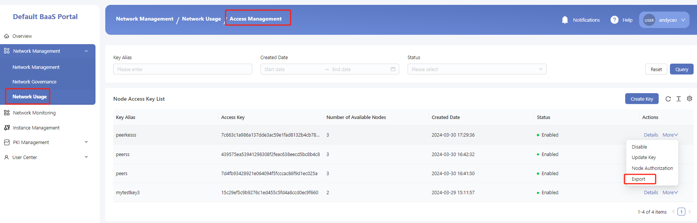
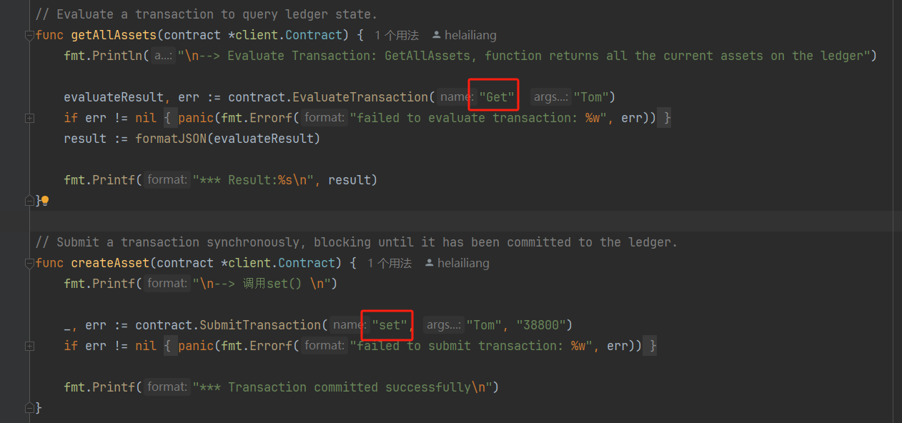

# dcmp use fabric example

### 1. 取dcmp 门户的Access Management页面选择接入key 导出

### 2. 解压下载得到的zip文件

可以得到`接入节点地址`和`接入证书信息`

接入节点地址： 可以在下面文件中的excel文件中获取,  获取文件中 grpc 地址： grpcs://192.168.1.66:32444

接入证书信息： 可以在peerkess.zip中获取，里面包含msp和tls两个目录

### 3. 使用fabric-gateway进行接入

可以参考`fabric-gateway`官方说明。<a href="https://hyperledger-fabric.readthedocs.io/en/latest/gateway.html" target="_blank">了解更多</a>

具体例子可以参考：https://github.com/helailiang/dcmp/tree/main/dcmp-gateway

### 4. 需要获取可调用的链码名称和通道名称

**注意**！！！： 

 通过网关接入获取的证书，只有普通用户的角色，是没有对部署链码权限的。部署链码权限有Admin才有。

所以以上信息需要咨询链拥有者获取得到。

当前例子中：

链码名称为： chaincodeName

通道名称为： mychannel01

### 5. 根据部署链码的调用方法，修改代码内容

当前例子中，管理者部署的合约拥有： set、get 方法。

### 6. 运行main.go方法，查看结果

